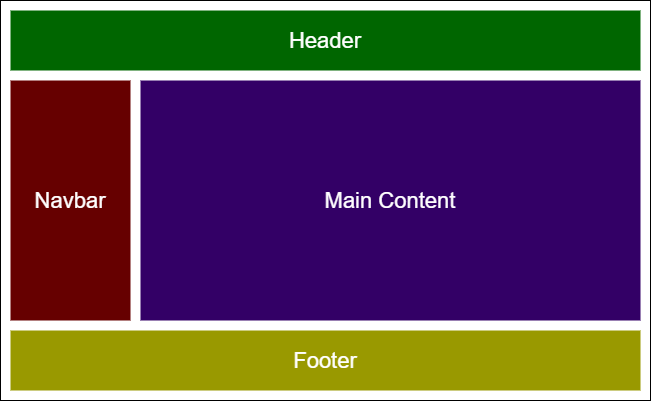

# Components

Components are independent and reusable bits of code. They serve the same purpose as JavaScript functions, but work in isolation and returns HTML via a render function.

Components come in two types, Class components and Function components.
