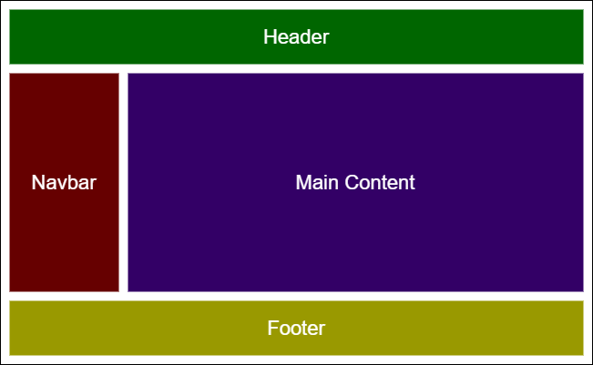

# Components



Components are independent and reusable bits of code Javascript. They serve the same purpose as JavaScript functions, but work in isolation and returns HTML via a render function.

Imagine that we are creating a website. We can break down the parts of the website into a sections. For example in the image above, we divided it into four sections, header, navbar, main content, and footer. We also need one more wrapper component called root component (App.js), to wrap the four existing components.

> Components are **reusable** and **could be contain anoter components**

Components come in two types, Stateful Class components and Stateless Functional components.

## Stateful Class Component

When creating a React component, the component's name must **start with an upper case letter**.

The component has to include the extends `React.Component` statement, this statement creates an inheritance to `React.Component`, and gives your component access to `React.Component`'s functions.

The component also requires a `render()` method, this method returns HTML.

**Example:**

```js
class Hello extends React.Component {
  render() {
    return <h1>Hello, {this.props.name}</h1>
  }
}
```

## Stateless Functional Component

A Functional component also returns HTML, and behaves pretty much the same way as a Class component.

Here is the same example as above, but created using a Functional component instead.

**Example:**

```js
function Hello(props) {
  return <h1>Hello, {props.name}</h1>
}
```
